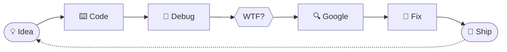

<div align="center">


<br>

<a href="https://github.com/Hieu082005"></a>
<a href="https://www.facebook.com/hieuhoahong2k5.com.vn"></a>
<a href="https://tiktok.com/@hieuhoahong2k5"></a>

<br><br>


</div>

<br>

## 👋 About Me

<table>
<tr>
<td width="58%" valign="top">

### Hi, I'm **La Văn Hiếu** 👨‍💻

A developer who loves turning random ideas into real, working projects — and then explaining to students *why* they work.

| | |
|---|---|
| 🌐 **Web** | Frontend, backend, REST APIs, full-stack |
| 🤖 **Automation** | Bots, scraping, tools that kill boring work |
| 🧠 **AI** | LLM APIs, smart assistants |
| 🐧 **Linux** | Self-hosting, servers, networking |
| 🔌 **Embedded** | ESP32, tiny devices doing useful things |

> **Build it. Break it. Fix it. Ship it.** 🚀

</td>
<td width="42%" align="center">

```text
╔═══════════════════════════╗
║  🍕 LA VĂN HIẾU           ║
╠═══════════════════════════╣
║  ROLE                     ║
║   ├─ Developer            ║
║   ├─ Teacher              ║
║   └─ Builder              ║
║                           ║
║  STATUS                   ║
║   ├─ 🟢 Coding            ║
║   ├─ 📚 Learning          ║
║   └─ 🧪 Experimenting     ║
║                           ║
║  LOCATION   Vietnam 🇻🇳    ║
╚═══════════════════════════╝
```

</td>
</tr>
</table>

---

## ⚡ Tech Stack

<div align="center">

<table>
<tr><td align="center"><b>Languages</b></td><td>

</td></tr>
<tr><td align="center"><b>Frameworks</b></td><td>

</td></tr>
<tr><td align="center"><b>Tools & Infra</b></td><td>

</td></tr>
<tr><td align="center"><b>Hardware</b></td><td>

</td></tr>
</table>

</div>

---

## 🚀 Featured Projects

> A kitchen full of experiments, bots, APIs and questionable ideas.

<div align="center">

<a href="https://github.com/Hieu082005/bottele"></a>
<a href="https://github.com/Hieu082005/botmess"></a>
<a href="https://github.com/Hieu082005/random-image-api"></a>
<a href="https://github.com/Hieu082005/hieuhoahong2k5.io"></a>

</div>

<details>
<summary><b>📦 All repositories (click to expand)</b></summary>
<br>

<!-- start: readme-repos-list -->
<!-- This list is auto-generated using koj-co/readme-repos-list -->
<!-- Do not edit this list manually, your changes will be overwritten -->
[](https://github.com/Hieu082005/bottele)
[](https://github.com/Hieu082005/hieuhoahong2k5)
[](https://github.com/Hieu082005/ddos)
[](https://github.com/Hieu082005/h-u-2005)
[](https://github.com/Hieu082005/lvh)
[](https://github.com/Hieu082005/botmess)
[](https://random-image-api-rosy.vercel.app)
[](https://github.com/Hieu082005/hieuhoahong2k5.io)
<!-- end: readme-repos-list -->

</details>

<div align="center">
<a href="https://github.com/Hieu082005?tab=repositories"></a>
</div>

---

## 🧩 What I Build

<table>
<tr>
<td width="33%" align="center">

### 🤖 Automation
Bots, APIs, scraping and tools that remove boring repetitive work.

</td>
<td width="33%" align="center">

### 🌐 Web
Modern frontend, backend services, REST APIs and full-stack apps.

</td>
<td width="33%" align="center">

### 🔌 Hardware
ESP32, embedded systems and tiny devices doing surprisingly useful things.

</td>
</tr>
</table>

---

## 📊 GitHub Analytics

<div align="center">


<br><br>


<br><br>


<br><br>


</div>

---

## 🧠 Developer Mindset

<div align="center">



### `while (alive) { learn(); build(); repeat(); }`

</div>

---

## 🍕 Current Build

<div align="center">

```yaml
Developer:
  name: La Văn Hiếu
  location: Vietnam 🇻🇳

Focus:
  - Web Development
  - Automation
  - AI
  - Bots
  - Linux
  - ESP32

Philosophy:
  - Build fast
  - Learn constantly
  - Fix what breaks
  - Ship useful things

Fuel:
  - Coffee ☕
  - Music 🎧
  - Pizza 🍕
  - Questionable ideas 💡
```

</div>

---

## 📫 Connect

<div align="center">

<a href="https://github.com/Hieu082005"></a>
<a href="https://www.facebook.com/hieuhoahong2k5.com.vn"></a>
<a href="https://tiktok.com/@hieuhoahong2k5"></a>

<br><br>

### 🍕 Thanks for stopping by.


<br>


</div>
